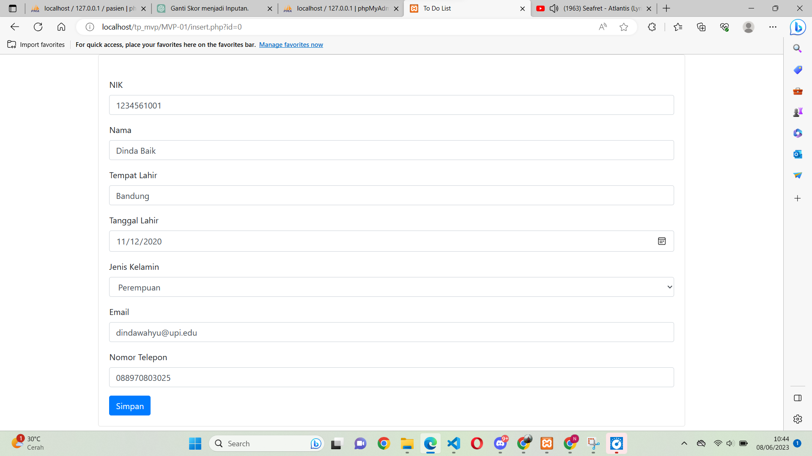

# LP11C2DPBO2023
Saya Nadhief Athallah Isya NIM 2106413 mengerjakan Latihan 11 dalam mata kuliah Desain dan Pemrograman Berorientasi Objek untuk keberkahanNya maka saya tidak melakukan kecurangan seperti yang telah dispesifikasikan. Aamiin.

## Deskripsi Tugas
Setelah kalian berhasil mengakses programnya, buatlah fitur CRUD untuk tabel yang sudah disediakan, dan tampilkan 2 kolom baru yaitu kolom email dan telepon yang sudah ada pada database.

## Desain Program
Program ini memiliki 1 tabel, yaitu pasien. Tabel ini memiliki 8 atribut, yaitu id sebagai PK, nama, tempat, tl, gender, email, dan telp. Tabel ini merepresentasikan data seorang pasien.

## Penjelasan Alur
1. Pada halaman home terdapat tabel data pasien
2. tekan tombol tambah data di atas tabel untuk menambahkan data 
3. tekan tombol delete untuk menghapus data pasien.
4. tekan tombol update untuk mengupdate data pasien maka akan di arah ke halam form pasien

## Dokumentasi

